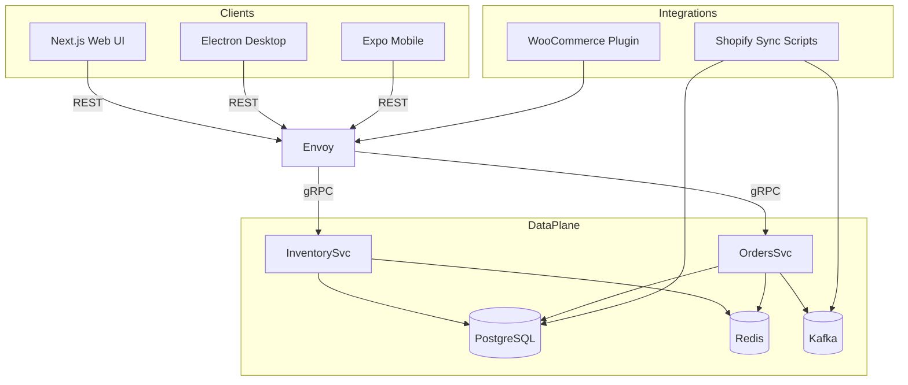
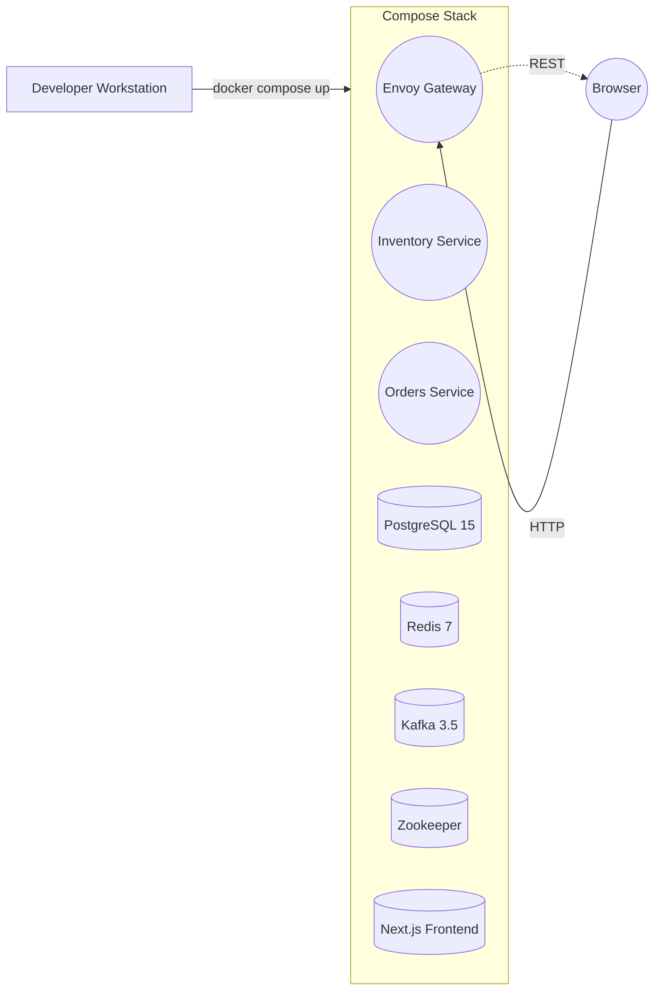
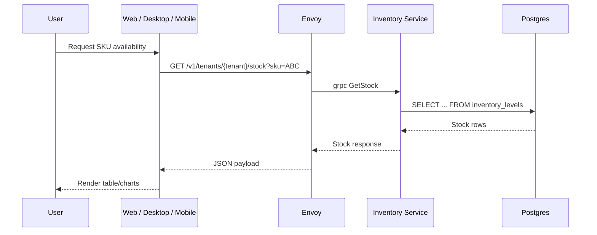
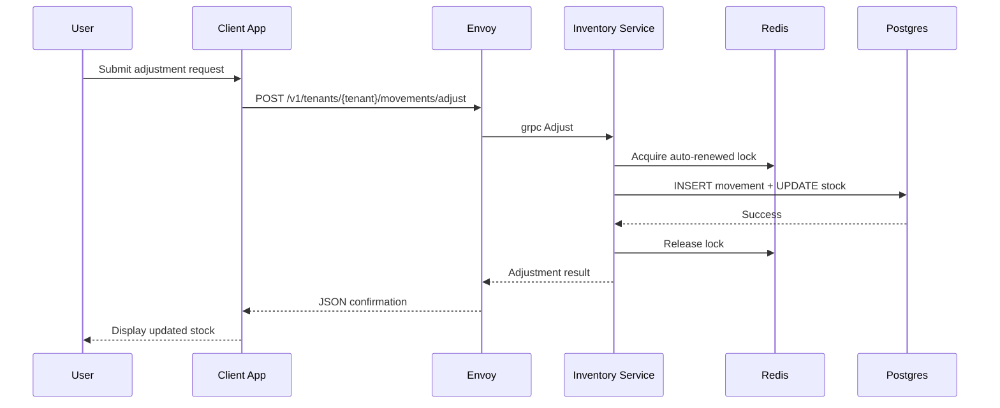
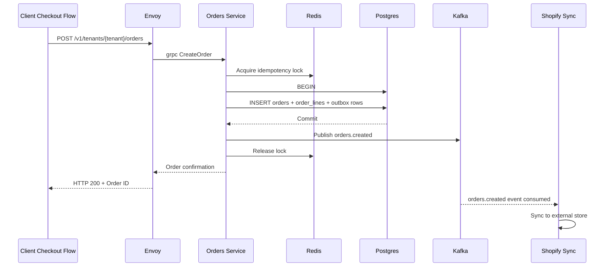
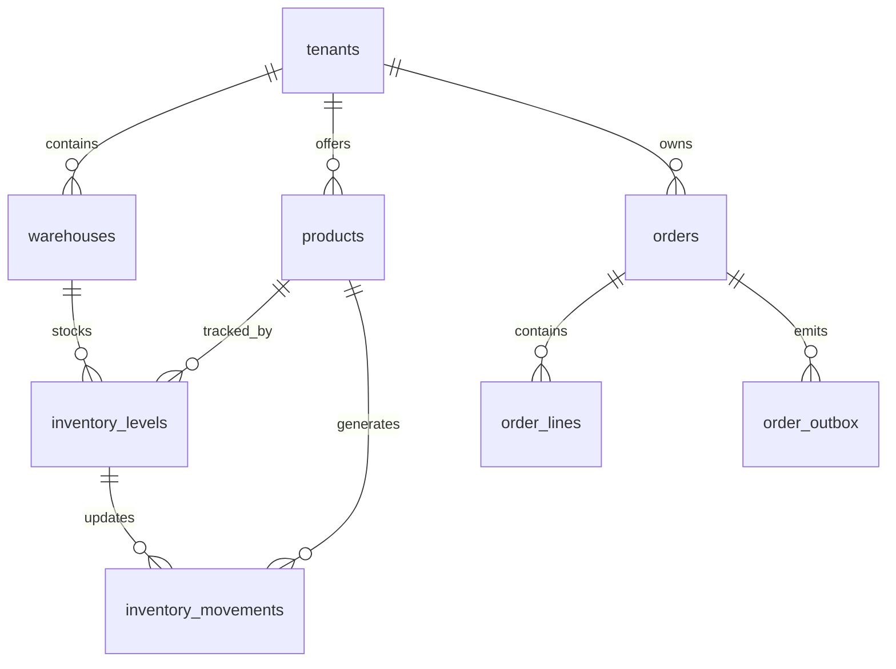

# OmniStock — C++ gRPC Inventory Template

Multi-tenant, high-performance inventory/warehouse template with:
- C++20 microservices (gRPC)
- Envoy REST↔gRPC transcoding
- PostgreSQL + Redis + Kafka
- Next.js web (App Router)
- Docker Compose for dev

## Table of Contents

1. [Development Setup](#development-setup)
2. [Architecture Overview](#architecture-overview)
3. [Detailed Component Guide](#detailed-component-guide)
4. [Runtime Data Flows](#runtime-data-flows)
5. [Persistence Model](#persistence-model)
6. [Client Applications](#client-applications)
7. [Operations & Observability](#operations--observability)
8. [Testing Strategy](#testing-strategy)
9. [Extensibility & Future Improvements](#extensibility--future-improvements)
10. [Reference](#reference)

## Development Setup

1. **Fetch Google API annotations** (required for REST↔gRPC transcoding):
   ```bash
   git submodule update --init --recursive third_party/googleapis
   # or manually download google/api/{annotations,http}.proto into third_party/googleapis
   ```

2. **Generate descriptor set for Envoy’s transcoder**:
   ```bash
   protoc -I=proto -I=third_party/googleapis \
     --include_imports --include_source_info \
     --descriptor_set_out=proto/descriptors.pb proto/*.proto
   ```

3. **Start the full stack** (PostgreSQL, Redis, Kafka, gRPC services, Envoy, and the Next.js UI):
   ```bash
   docker compose -f deploy/docker-compose.yml up --build
   ```

4. **Visit the UI** at [http://localhost:3000](http://localhost:3000) to adjust stock levels and create orders. The UI talks to
Envoy’s REST endpoint which transparently proxies gRPC calls.

> 💡 **Tip:** During development, you can rebuild a single service without tearing down the full stack:
> ```bash
> docker compose -f deploy/docker-compose.yml up --build inventory_svc
> ```
> Docker only rebuilds the targeted service while other dependencies keep running.

## Architecture Overview

OmniStock follows a modular, service-oriented architecture designed to showcase modern warehouse and commerce integrations. The high-level component graph below captures the main building blocks and their relationships.



### Why this architecture?

- **Loose coupling:** Clients use REST while services communicate via gRPC, keeping protocols optimized per boundary.
- **Operational realism:** Docker Compose mirrors a production-like stack (database, cache, message broker) for learning modern integrations.
- **Extensible edges:** Kafka and HTTP webhooks enable additional downstream systems without touching the core services.

### Deployment topology



All containers share a user-defined Docker network, allowing service discovery through Compose service names (e.g., `postgres:5432`).

## Detailed Component Guide

This section drills into each major component, summarizing its responsibilities, source location, configuration, and noteworthy implementation choices.

### Envoy API Gateway (`api-gateway/`)

- **Purpose:** Exposes RESTful endpoints to clients while proxying requests to gRPC services using Envoy’s transcoding filter.
- **Key configuration:** `api-gateway/envoy.yaml` defines route matching, upstream clusters, and the descriptor set for gRPC translation.
- **Observability hooks:** Access logs stream to stdout, and Envoy’s admin interface is enabled on port 9901 for debugging (stats, config dumps, etc.).
- **Local tips:** If you update proto files, regenerate `proto/descriptors.pb` and restart the gateway to pick up new message shapes.

### Inventory Service (`services/inventory_svc/`)

- **Language/tooling:** CMake + C++20 with gRPC and libpqxx.
- **Responsibilities:**
  - Fetch current stock by tenant, SKU, or warehouse.
  - Apply stock adjustments while ensuring serialized access via Redis leases.
  - Record movement history in PostgreSQL for auditability.
- **Interesting detail:** The service leverages a reusable RAII Redis lock (see `services/common/redis_lock.h`) that auto-renews to protect long-running transactions.
- **Configuration:** Environment variables set DB credentials, Redis URI, and lock TTL; see `deploy/docker-compose.yml` for defaults.

### Orders Service (`services/orders_svc/`)

- **Language/tooling:** Matches the inventory stack (C++20, gRPC, libpqxx, Redis, Kafka).
- **Responsibilities:**
  - Validate and persist orders, line items, and payment/shipping metadata.
  - Guarantee idempotency using Redis keys derived from tenant and external order identifiers.
  - Publish `orders.created` events to Kafka for downstream consumers (e.g., Shopify sync).
  - Maintain an outbox table to decouple persistence from message publishing.
- **Error handling:** Orders fail fast with descriptive gRPC status codes; retriable operations (Kafka, Redis) use exponential backoff.

### Commerce Integrations (`integrations/`)

- **Shopify (`integrations/shopify/`):** Node.js scripts that poll OmniStock for inventory changes, push updates to Shopify, and expose an Express webhook for order ingestion.
- **WooCommerce (`integrations/wordpress/`):** A WordPress plugin that queries OmniStock’s REST endpoints to surface live stock data inside WooCommerce product pages.
- **Extensibility:** Both integrations are optional and can be replaced or augmented with additional connectors (e.g., Amazon Marketplace, ERP sync).

### Client Apps (`web/`, `apps/desktop/`, `apps/mobile/`)

- **Next.js Web UI:** Provides a responsive control panel for browsing stock, adjusting inventory, and creating orders. Uses SWR for data fetching and Tailwind for styling.
- **Electron Desktop:** Wraps the web experience with native menus, offline caching, and configurable base URLs suited for warehouse kiosks.
- **Expo Mobile:** React Native implementation optimized for tablets/phones with touch-friendly controls and offline-first request queues.

## Runtime Data Flows

To understand how information travels through the system, the following sequence diagrams illustrate common operations.

### Stock lookup



### Inventory adjustment



### Order creation & event publishing



## Persistence Model

The PostgreSQL schema emphasizes auditability and multi-tenant isolation. The simplified ER diagram below highlights core tables.



### Table summary

| Table | Purpose | Notable columns |
| --- | --- | --- |
| `tenants` | Logical partitioning between organizations. | `id`, `slug`, `name` |
| `products` | Catalog metadata. | `sku`, `description`, `price_cents` |
| `warehouses` | Physical stocking locations. | `code`, `address` |
| `inventory_levels` | Current on-hand quantities per tenant/product/warehouse. | `available_qty`, `reserved_qty` |
| `inventory_movements` | Immutable history of adjustments. | `delta`, `reason`, `performed_by` |
| `orders` | Order headers with customer/payment info. | `external_id`, `status`, `totals` |
| `order_lines` | Line item quantities and pricing. | `product_id`, `quantity`, `unit_price` |
| `order_outbox` | Event sourcing bridge for Kafka. | `event_type`, `payload`, `published_at` |

## Client Applications

| Surface | Path | Purpose |
| --- | --- | --- |
| Web | `web/` | Next.js App Router UI shipped with Docker Compose (port 3000). |
| Desktop | `apps/desktop/` | Electron shell for quick inventory lookups and order entry. |
| Mobile | `apps/mobile/` | Expo (React Native) app optimised for tablets/phones. |

Each client shares the same REST endpoints. Update the base URL/tenant inputs if your stack is not running locally.

### Desktop

```bash
cd apps/desktop
npm install
npm start
```

### Mobile (Expo)

```bash
cd apps/mobile
npm install
npm run start
```

Scan the QR code with Expo Go or launch an emulator. Adjust API details from within the app header.

### Service Highlights

- **Inventory Service** — uses PostgreSQL for the authoritative stock ledger and Redis-backed leases that renew automatically, preventing concurrent writers from trampling long running adjustments.
- **Orders Service** — persists orders and line items to PostgreSQL, enqueues outbox rows, and publishes an `orders.created` Kafka event for downstream connectors. Idempotent requests are guarded with Redis locks keyed by tenant/external id.
- **Envoy Gateway** — exposes `/v1/tenants/{tenantId}/stock`, `/movements/adjust`, and `/orders` with distinct routing rules so both services are reachable via REST.

### Commerce Integrations

- **WooCommerce** — `integrations/wordpress/` contains a plugin that embeds live OmniStock availability on product pages.
- **Shopify** — `integrations/shopify/` provides scripts for inventory synchronisation and an order webhook bridge. See the directory README for environment variables and usage.

### Resetting the Database

The seed script under `deploy/seed/00_schema.sql` bootstraps tenants, products, inventory, and the new `orders`/`order_lines` tables. To start fresh, remove the `pgdata` volume (`docker volume rm deploy_pgdata`) and re-run Docker Compose.

## Operations & Observability

| Concern | Tooling | Notes |
| --- | --- | --- |
| **Logs** | Docker Compose stdout | Tail individual services: `docker compose logs -f orders_svc`. |
| **Metrics** | Envoy admin, custom exporters | Add Prometheus scraping via Envoy stats or extend services with OpenTelemetry exporters. |
| **Tracing** | OpenTelemetry (not enabled by default) | Instrument gRPC calls with OTLP exporters for distributed tracing. |
| **Health checks** | gRPC health checking & `/healthz` REST routes | Each service exposes a standard gRPC health service; Envoy can surface HTTP `/healthz` endpoints. |

### Scaling considerations

- **Horizontal scaling:** Run multiple replicas of inventory/orders services. Redis locks preserve consistency, while Kafka partitions handle increased throughput.
- **Read scalability:** Introduce read replicas for PostgreSQL and configure services for read/write splitting.
- **Global deployments:** Leverage tenant sharding by region and deploy multiple Envoy gateways behind a global load balancer.

## Testing Strategy

OmniStock intentionally combines multiple testing layers to reinforce best practices.

| Layer | Scope | Location | Command |
| --- | --- | --- | --- |
| **Unit tests** | C++ business logic (lock helpers, validation) | `services/*/tests/` (add as needed) | `ctest` after building with CMake |
| **Integration tests** | Service-to-database interactions | Future addition under `tests/integration/` | `docker compose -f deploy/docker-compose.test.yml up` |
| **Contract tests** | Envoy REST ↔ gRPC compatibility | `proto/` definitions & Postman collection | `npm run test:contracts` (placeholder) |
| **UI tests** | Web client flows | `web/` (Playwright/Cypress recommended) | `npm --prefix web run test` |

> 📘 **Educational exercise:** Students are encouraged to extend the repository with automated tests, tracing how requests propagate end-to-end.

## Extensibility & Future Improvements

The following roadmap items are intentionally left open for experimentation and coursework:

- **Order fulfillment workflows:** Implement a picking/packing microservice triggered by `orders.created` events, updating shipment statuses and generating shipping labels.
- **Advanced inventory logic:** Add safety stock calculations, cycle counts, and multi-warehouse replenishment recommendations using background jobs.
- **Analytics layer:** Stream Kafka events into a data warehouse (e.g., BigQuery, Snowflake) and expose dashboards for throughput, stockouts, and order profitability.
- **Authentication & RBAC:** Integrate an identity provider (Auth0, Keycloak) so tenants/users authenticate before accessing the APIs or UI.
- **Observability upgrades:** Ship logs to OpenSearch, export metrics to Prometheus, and wire Jaeger tracing for distributed performance insight.
- **Testing automation:** Create a GitHub Actions pipeline that builds services, runs unit/integration tests, and publishes Docker images.
- **Disaster recovery drills:** Document backup/restore procedures for PostgreSQL, Redis snapshots, and Kafka offsets.
- **Infrastructure-as-code:** Port the Docker Compose topology to Terraform + Kubernetes manifests for cloud-native deployments.

## Reference

- **Proto definitions:** `proto/inventory.proto`, `proto/orders.proto`
- **C++ reusable utilities:** `services/common/`
- **Database seed scripts:** `deploy/seed/`
- **Operational scripts:** `deploy/`
- **Learning resources:**
  - [gRPC Concepts](https://grpc.io/docs/what-is-grpc/core-concepts/)
  - [Envoy Proxy docs](https://www.envoyproxy.io/docs)
  - [PostgreSQL Tutorial](https://www.postgresql.org/docs/current/tutorial.html)
  - [Kafka Fundamentals](https://kafka.apache.org/documentation/#gettingStarted)

For further questions or contributions, open an issue or submit a pull request—OmniStock is built as a teaching aid, and we welcome enhancements that make the learning experience richer.
=======
# OmniStock — C++ gRPC Inventory – Under Development

Multi-tenant, high-performance inventory/warehouse template with:
- C++20 microservices (gRPC)
- Envoy REST↔gRPC transcoding
- PostgreSQL + Redis + Kafka
- Next.js web (App Router)
- Docker Compose for dev

## Development Setup
<<<<<<< codex/review-the-project-ynuseo

1. **Fetch Google API annotations** (required for REST↔gRPC transcoding):
   ```bash
   git submodule update --init --recursive third_party/googleapis
   # or manually download google/api/{annotations,http}.proto into third_party/googleapis
   ```

2. **Generate descriptor set for Envoy’s transcoder**:
   ```bash
   protoc -I=proto -I=third_party/googleapis \
     --include_imports --include_source_info \
     --descriptor_set_out=proto/descriptors.pb proto/*.proto
   ```

3. **Start the full stack** (PostgreSQL, Redis, Kafka, gRPC services, Envoy, and the Next.js UI):
   ```bash
   docker compose -f deploy/docker-compose.yml up --build
   ```

4. **Visit the UI** at [http://localhost:3000](http://localhost:3000) to adjust stock levels and create orders. The UI talks to Envoy’s REST endpoint which transparently proxies gRPC calls.

## Client Applications

| Surface | Path | Purpose |
| --- | --- | --- |
| Web | `web/` | Next.js App Router UI shipped with Docker Compose (port 3000). |
| Desktop | `apps/desktop/` | Electron shell for quick inventory lookups and order entry. |
| Mobile | `apps/mobile/` | Expo (React Native) app optimised for tablets/phones. |

Each client shares the same REST endpoints. Update the base URL/tenant inputs if your stack is not running locally.

### Desktop

```bash
cd apps/desktop
npm install
npm start
```

### Mobile (Expo)

```bash
cd apps/mobile
npm install
npm run start
```

Scan the QR code with Expo Go or launch an emulator. Adjust API details from within the app header.
=======

1. **Fetch Google API annotations** (required for REST↔gRPC transcoding):
   ```bash
   git submodule update --init --recursive third_party/googleapis
   # or manually download google/api/{annotations,http}.proto into third_party/googleapis
   ```

2. **Generate descriptor set for Envoy’s transcoder**:
   ```bash
   protoc -I=proto -I=third_party/googleapis \
     --include_imports --include_source_info \
     --descriptor_set_out=proto/descriptors.pb proto/*.proto
   ```

3. **Start the full stack** (PostgreSQL, Redis, Kafka, gRPC services, Envoy, and the Next.js UI):
   ```bash
   docker compose -f deploy/docker-compose.yml up --build
   ```

4. **Visit the UI** at [http://localhost:3000](http://localhost:3000) to adjust stock levels and create orders. The UI talks to Envoy’s REST endpoint which transparently proxies gRPC calls.
>>>>>>> main

### Service Highlights

- **Inventory Service** — uses PostgreSQL for the authoritative stock ledger and Redis-backed leases that renew automatically, preventing concurrent writers from trampling long running adjustments.
- **Orders Service** — persists orders and line items to PostgreSQL, enqueues outbox rows, and publishes an `orders.created` Kafka event for downstream connectors. Idempotent requests are guarded with Redis locks keyed by tenant/external id.
- **Envoy Gateway** — exposes `/v1/tenants/{tenantId}/stock`, `/movements/adjust`, and `/orders` with distinct routing rules so both services are reachable via REST.

<<<<<<< codex/review-the-project-ynuseo
### Commerce Integrations

- **WooCommerce** — `integrations/wordpress/` contains a plugin that embeds live OmniStock availability on product pages.
- **Shopify** — `integrations/shopify/` provides scripts for inventory synchronisation and an order webhook bridge. See the directory README for environment variables and usage.

=======
>>>>>>> main
### Resetting the Database

The seed script under `deploy/seed/00_schema.sql` bootstraps tenants, products, inventory, and the new `orders`/`order_lines` tables. To start fresh, remove the `pgdata` volume (`docker volume rm deploy_pgdata`) and re-run Docker Compose.

>>>>>>> main

